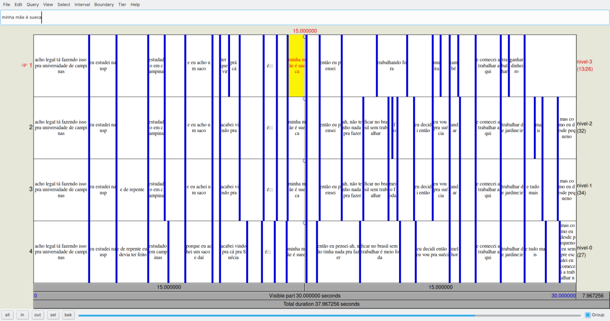
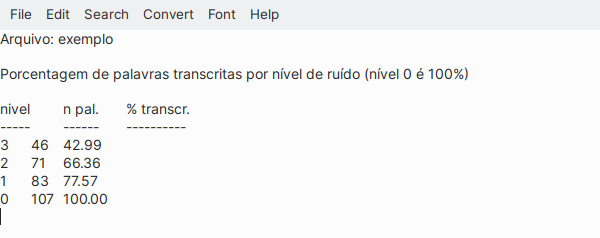

# porcentagem\_palavras.praat

Script auxiliar para o relatório de segmentação em ruído, usado no curso "Iniciação à Fonética Forense", ministrado por Renata Passetti e Pablo Arantes na Escola de Estudos Linguísticos do GEL, realizada em setembro de 2020.

O script facilita a extração da informação da porcentagem de palavras registradas em diferentes camadas em um arquivo TextGrid, tomando como referência o número de palavras de uma camada de referência, como na figura a seguir (camada 4 na figura).

Ao ser executado, o script abrirá uma janela para que o usuário selecione em alguma pasta do computador do usuário um arquivo TextGrid a ser analisado. Após a execução, uma janela como a mostrada na figura a seguir aparecerá. O script processa apenas um arquivo TextGrid por vez.

## Changelog

Veja o arquivo [CHANGELOG](CHANGELOG.md) para consultar a história das versões do arquivo.

## Licença

Veja o arquivo [LICENSE](LICENSE.md) para mais informações a respeito da licença adotada para o código-fonte.

## Como citar

Clique no botão DOI acima para ver as instruções a respeito de como citar o script.
